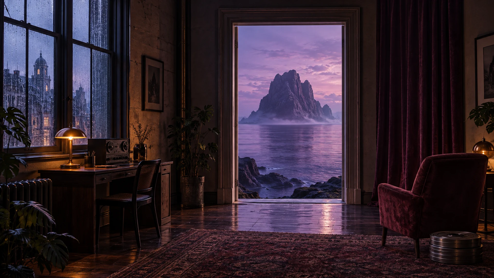

# Jhinx, after hours.

I'm Yas, a creator and tinkerer in Montréal. I make stories, build small tools, and follow interesting ideas a little further than planned.

[My corner of the internet](https://jhinx.dev) · [The stories](https://jhinx.dev/stories) · [The workshop](https://jhinx.dev/projects) · [Life lately](https://jhinx.dev/now)

## Two channels. Two different worlds.

Most of my creative energy goes into YouTube:

**[Past Patterns](https://www.youtube.com/@PastPatternsArchive)** is about history, human error, strange beliefs, and the patterns we keep repeating. I bring research, writing, illustrated scenes, and editing together in documentary stories and Shorts. Lately, I've been revisiting earlier stories with more expressive pictures, clearer openings, and restrained animation.

**[Arcane Domain](https://www.youtube.com/@ArcaneDomainStories)** follows mage Orrin and warrior Mael through short fantasy comedies. Impossible quests, unreliable magic, questionable decisions. It's a different kind of storytelling, with room for atmosphere, mischief, and a plan that rarely survives contact with the characters.

I like the whole process: finding the human question inside a story, shaping its visual world, choosing the sound, and figuring out which details actually earn their place. The tools below grew around that work.

## Behind the scenes

My software archive includes prototypes, older experiments, and tools I still use. These are personal projects with different histories, not a catalogue of products all under active development.

- **[North Star Studio](https://jhinx.dev/projects/northstar-lab)** is my private creative review desk. It brings video cuts, visual designs, sound choices, and recorded decisions together. A recent improvement keeps music, ambience, and effects playable beside the finished video, so reviewing a cut doesn't mean hunting through folders.
- **[Omakase Plus](https://jhinx.dev/projects/omakase-plus)** is a private anime-library project with clearer watch progress, optional completion ratings, and checks that distinguish a completed transfer from something ready to watch. [Public documentation](https://omakase-plus.jhinx.dev).
- **[Omakase](https://github.com/HeyiTzSenpai/omakase)** explores a more personal watch menu, using anime history and taste notes to shape recommendations.
- **[jhinx.dev](https://jhinx.dev)** is the visual home for the stories, project notes, current listening rotation, and the person between the projects.

## Off the clock

Anime, music, and the occasional homelab rabbit hole. I enjoy useful systems and thoughtful interfaces, but not everything needs to become a project. Sometimes a song on repeat is enough.

[What I'm up to](https://jhinx.dev/now) · [Homelab](https://jhinx.dev/services) · [AniList](https://anilist.co/user/HeyiTzSenpai)

`Python` · `TypeScript` · `React` · `Next.js` · `Docker` · `Proxmox`
